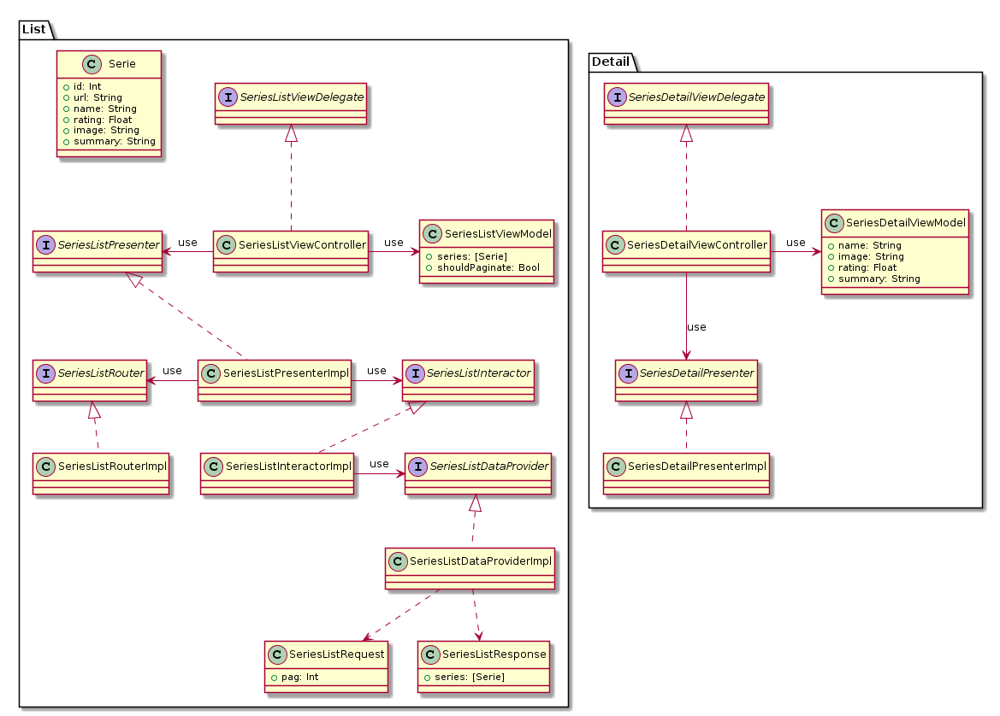

# Prueba técnica

## Introducción

### Objetivo
Consiste en el desarrollo de una aplicación iOS que conste de una pantalla principal con un listado de elementos y un detalle.

### Requisitos

Para el listado se definen los siguientes requisitos:  
- Utilizar la API de TV Maze  
- Mostrar un listado de series  
- De cada elemento de la lista mostrar imagen y nombre  
- Se ha de poder paginar  
  
Para el detalle de cada serie:  
- Se debe mostrar imagen, nombre, puntuación y sinopsis

### Tecnología
**Lenguaje:** Swift 5  
**Entorno:** Xcode 11.3.1

### Dependencias
**API:** http://www.tvmaze.com/api

## Planificación

### Tareas

**T1. Creación y configuración del proyecto**  
**T2. Desarrollo del listado**  
T2-1. Crear arquitectura funcionalidad  
T2-2. Capa de negocio  
T2-3. Capa de datos  
T2-4. Capa de vista  
**T3. Desarrollo del detalle**  
T3-1. Crear arquitectura funcionalidad  
T3-2. Capa de negocio  
T3-3. Capa de vista  

### Diagrama de clases
En esta sección se pretende mostrar un modelado de la arquitectura planificada para su desarrollo. La intención es basarse en VIPER para definir esta arquitectura. 

## Desarrollo
